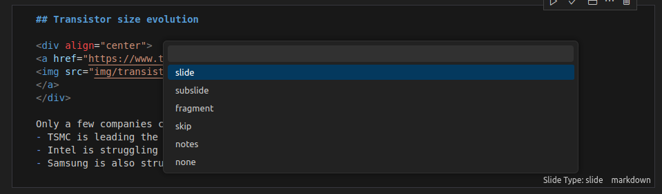

# Introduction to Computer Programming Course Material

This repository contains all the source material for the "Introduction to Computer Programming" course, available online at [https://introcp.github.io/](https://introcp.github.io/).

A (full) ToC of the course is available at [https://introcp.github.io/toc](https://introcp.github.io/toc).

## 1. Repository Structure

The repository is organized into four main directories:

-   `src/`: Contains the source Jupyter Notebooks for all course materials. Notebooks are organized into topic-specific folders based on a unique ID:

    -   **AXX** (e.g., `A00`, `A01`): Course organization details.
    -   **CXX** (e.g., `C00`, `C01`): Theoretical lectures on computer systems.
    -   **PXX** (e.g., `P00`, `P01`): Theory lectures on Python.
    -   **EXX** (e.g., `E00`, `E01`): Exercise collections.
    -   **HXX** (e.g., `H00`, `H01`): Homework assignments, following the same student/pseudocode/solution variants as `EXX` (see [2b. Exercises](#2b-exercises)). Homework notebooks are not linked into the public website's table of contents (`_toc.yml`).

    The ID for each lecture corresponds to the internal course timetable (see Google Spreadsheet). Within each folder, the typical structure is:

    -   `img/`: A directory for images used in the notebook.
    -   `<ID>-Title-of-the-Lecture.ipynb`: The source notebook file.
    -   `<ID>-Title-of-the-Lecture.slides.html`: Auto-generated HTML slides.
    -   `<ID>-Title-of-the-Lecture.pdf`: Auto-generated PDF slides.

-   `docs/`: The output directory where the generated website (built by Jupyter Book) is stored. This directory is served by GitHub Pages.

-   `scripts/`: A collection of Python and shell scripts for automating tasks like converting notebooks to slides and finalizing the website.

-   `exercises/`: A indipendent subrepository for creating, managing, and generating programming collections of exercises.

## 2. Course Materials

The course content is divided into two main types: theory slides and exercises.

### 2a. Theory Slides

Theory lectures are **manually** created as Jupyter Notebooks (`.ipynb`) in the `src/` directory.

#### Creating a New Lecture Notebook

1.  **Structure**: Each notebook should start with a Markdown cell for the title with a specific structure (Title, Course Title, Bachelor, Logo). You can see an example in `src/A00/A00-Introduction.ipynb`.
2.  **Slide Markup**: To structure the notebook as a slide deck, use the cell metadata editor in VS Code or Jupyter. Mark cells with the following `slideshow` metadata:
    *   `"slide_type": "slide"`: Starts a new slide.
    *   `"slide_type": "fragment"`: Part of the previous slide whose content will appear on click.
    *   `"slide_type": "none"` (or missing): The cell content will be appended to the previous slide.

Slide cell types can be easily changed using the VS Code extension "Jupyter: Slideshow":


### 2b. Exercises

Exercise notebooks are auto-generated from a source template system located in the repository `exercises` localted at `exercises/` directory for convenience. They are generated in three variants:

-   **Student mode**: The standard version for students to solve.
-   **Pseudocode mode**: Includes step-by-step hints on how to approach the solution.
-   **Solution mode**: Contains the complete solution.

Generated notebooks are placed in `src/EXX` to be included in the final website, and they are linked from the theory notebooks. For detailed instructions on creating and generating exercises, refer to the `exercises/README.md` file.

## 3. Previewing Slides

You can generate and preview HTML/PDF slides for a single notebook using the `scripts/generate-slides-from-notebook` script. This script uses Docker to ensure a consistent environment.

**Platform notes:** all the slide generation happens inside the Docker container, so the host OS itself doesn't matter for the build — but the `scripts/generate-slides-from-notebook` script and the `Makefile` targets (`docker-run`, `docker-build-book`, ...) are Bash/POSIX scripts (they use `bash`, `chmod`, and `` `id -u`/`id -g` ``), so you need a Unix-like shell to run them:

-   **Linux / macOS**: works out of the box in a normal Terminal, as long as [Docker Desktop](https://www.docker.com/products/docker-desktop/) (or the Docker Engine) is installed and running.
-   **Windows**: run these commands from **WSL2** (Windows Subsystem for Linux), with Docker Desktop's WSL2 integration enabled ("Settings → Resources → WSL Integration"), and with the repository cloned inside the WSL2 filesystem. Native `cmd.exe`/PowerShell are not supported directly, since they don't provide `bash`, `make`, or `id`. Git Bash can work as an alternative but is not recommended: it is missing `make` by default, and it is known to mis-translate Docker volume paths (e.g. `-v $(PWD):/home/user/introcp`) in some setups.

```bash
# Fetch the container image
docker pull ercoppa/introcp

# Make the script executable
chmod +x scripts/generate-slides-from-notebook

# Run the script with the path to your notebook
./scripts/generate-slides-from-notebook src/A00/A00-Introduction.ipynb
```

This will start a watch process that automatically regenerates the slides whenever you save the notebook. You will find the generated HTML and PDF slides in the same directory as the notebook, e.g., `src/A00/A00-Introduction.slides.html` and `src/A00/A00-Introduction.slides.pdf`.

## 4. Adding a Notebook to the Website TOC

To add a new notebook to the website's table of contents, edit the `_toc.yml` file. Add a new entry under the appropriate `caption` and `chapters` section, pointing to your notebook file:

```yaml
- file: src/YourFolder/YourNotebook.ipynb
```

## 5. Continuous Integration and Deployment

When you push changes to the `2026` branch, a GitHub Action is automatically triggered. This workflow, defined in `.github/workflows/build.yml`, performs the following steps:

1.  Builds the entire Jupyter Book website.
2.  Generates all HTML and PDF slides.
3.  Commits the updated `docs/` and `src/` directories back to the repository.
4.  Deploys the `docs/` directory to GitHub Pages.

The process is triggered automatically by GitHub Actions when you push changes to the `2026` branch and takes about 3 minutes to complete when updating a single notebook.